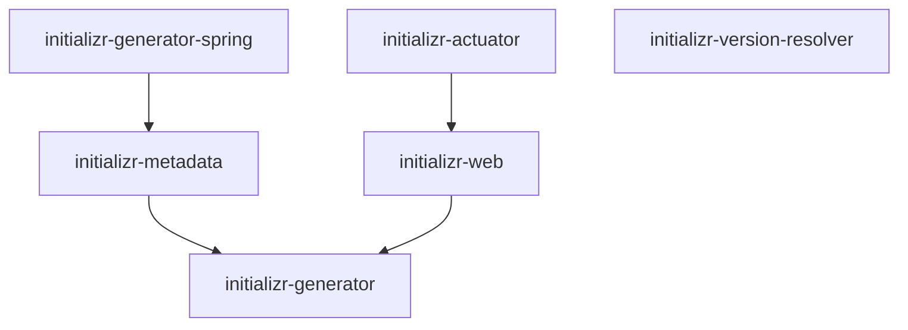

# How Spring Initializr Work

[Spring Initializr doc](https://docs.spring.io/initializr/docs/current/reference/html/#initializr-documentation)

## Spring Initializr Project

Module structure is like this

### Rest API in Spring Initializr Web Module

#### GET / Accepts: 'text/plain'

Defined in `io.spring.initializr.web.controller.CommandLineMetadataController.serviceCapabilitiesText`

This is used for commandline tools to provide project information.

For example, if you run `curl https://start.spring.io`, it will output [this](https://gist.github.com/stliu/87cb1a93ef50cf79f0e64a4707f1852d).

Currently it supports:

* curl
* HTTPie
* Spring CLI

Output varies based on the tool, and it detects the tool automatically based on `User-Agent` header.

